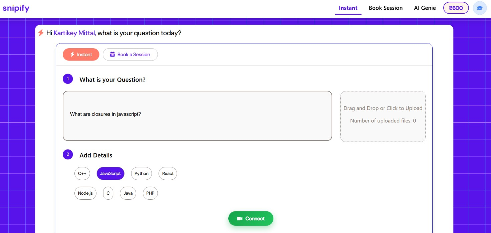
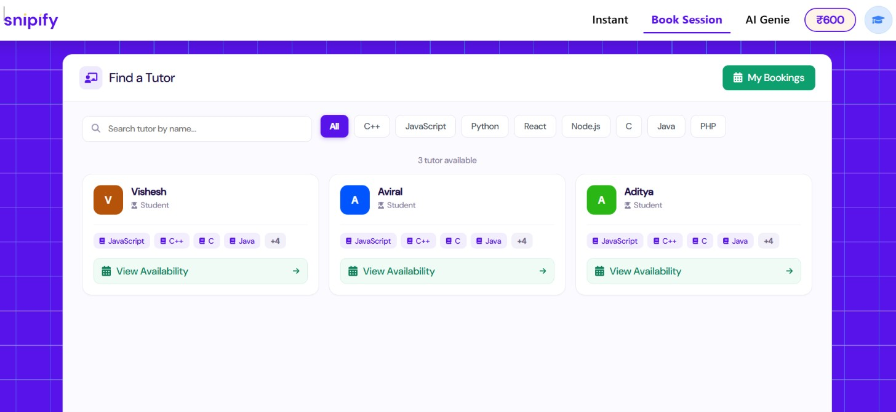
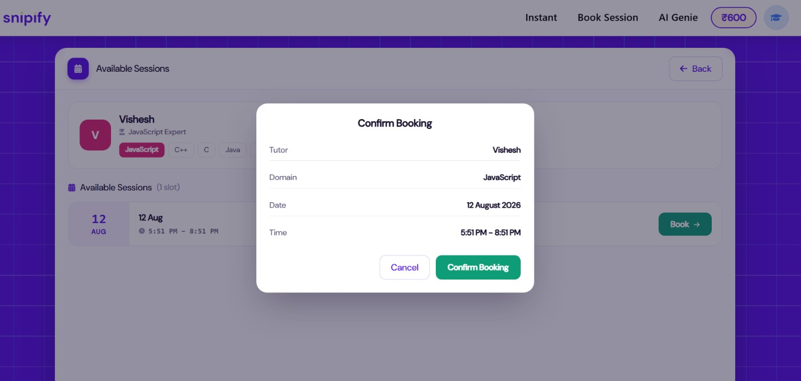
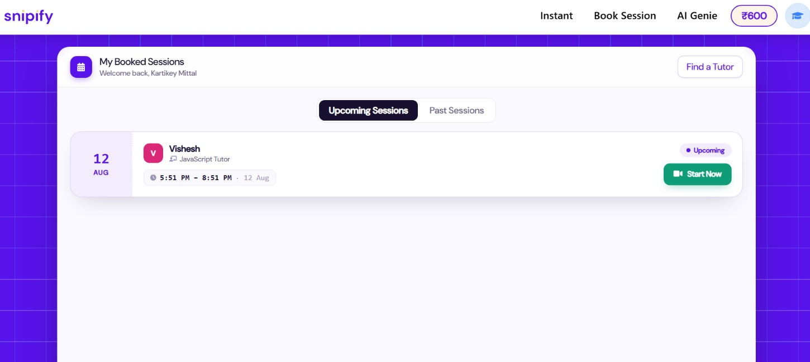
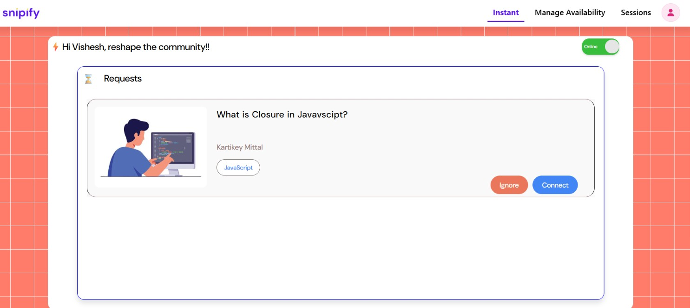
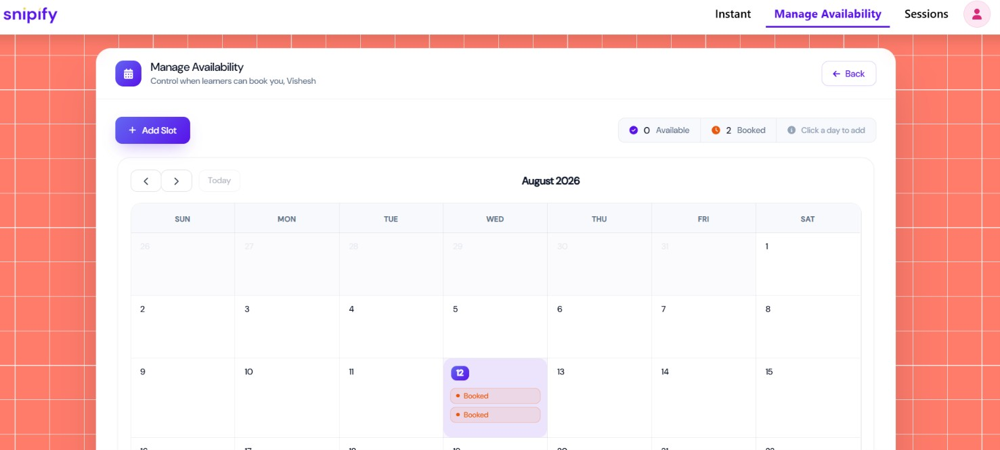
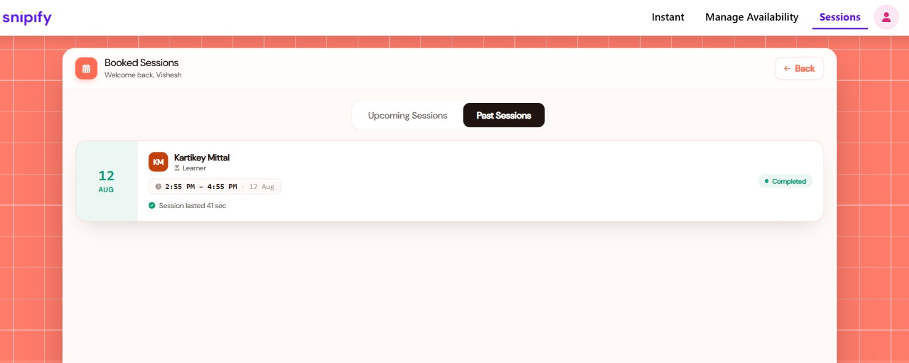
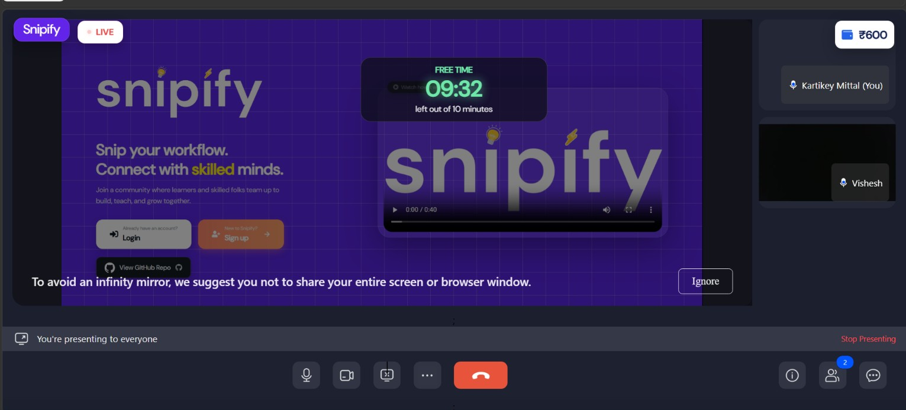
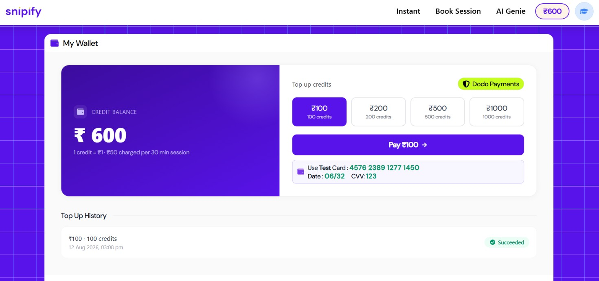
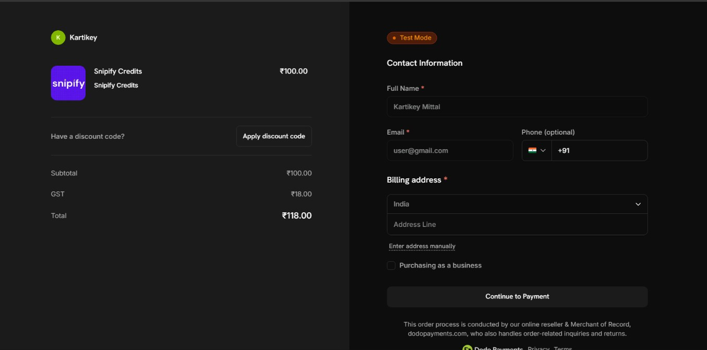

# Snipify

Snipify is a live tutoring platform where learners book 30-minute sessions with skilled tutors and join real-time ZegoCloud video meetings — with a full **booking, availability, session-charging, credits, and wallet/payment** flow implemented end-to-end.


> **Deploy Link:** [https://mysnipify.vercel.app/](https://mysnipify.vercel.app/)

---

## Before vs After — What Changed

This README shows the **base project** (what was given) and everything **newly implemented** from the assignment.

| Area | Before (Base Project) | After (What I Implemented) |
|---|---|---|
| **Tutor Booking** | No booking concept — random tutor match-up only | Learners browse tutors by **domain**, view tutor **availability**, and book a **30-minute session** |
| **Tutor Availability** | No availability system | Tutors set an availability timeframe (e.g. 7 AM – 11 PM) → the system **auto-generates 30-minute slots** inside that window |
| **Slot Management** | — | Tutors can see which slots are **available / booked** |
| **Booking Management** | — | Learner has **My Bookings**, tutor has **Booked Sessions**, **double booking is prevented**, all bookings stored in **Firebase** |
| **Live Session** | Separate/Zego rooms, no link to bookings | Booked sessions have a **Start Now** button → learner & tutor join the **same ZegoCloud room using the same roomId** |
| **Session Charging** | No billing | Every session gets **10 minutes free** → after that **₹50 per 30-minute block**; duration & cost are **recorded**, credits **deducted** live during the session |
| **Learner Credits** | No credits | New learners get **₹500 starting credit**; current balance shown in navbar & live-room; **balance can never go negative** |
| **Balance-Out Handling** | — | When credits run out, learner gets a **warning (Out of Credit)** → after grace period the session **ends automatically** and learner is taken back to **Home** |
| **Wallet / Payments** | No payments | **Phase 3:** Wallet UI with current balance, **top-up credits**, **payment/top-up history**, powered by **Dodo Payments (Test Mode)** |
| **Run-Out Flow** | — | Credits out during session → **Add Credits** → Wallet → **Dodo payment** → credits instantly added to balance |
| **Calendar Management** | — | Tutors manage availability through a **calendar UI** (FullCalendar) |

---

## Screenshots


### Learner Side

| **1. Learner Home** | **2. Find Tutor (Browse by Domain)** |
|---|---|
|  |  |

| **3. Tutor Availability (Slot Selection)** | **4. My Bookings** |
|---|---|
|  |  |

### Skilled (Tutor) Side

| **5. Skilled Home** | **6. Manage Availability (Calendar)** |
|---|---|
|  |  |

| **7. Booked Sessions** | **8.Live Meeting — Free Time Countdown* |
|---|---|
|  |  |


### Wallet / Payments (Dodo)

| **13. Wallet (Balance + Top-up)** | **14. Dodo Payment Page (Test Mode)** |
|---|---|
|  |  |


---

## Implementation (Feature-by-Feature)

### 1️⃣ Tutor Booking
- Learners browse tutors filtered by **domain** (`FindTutor`).
- Each tutor card shows their **availability window**.
- Learners pick a free slot and **book a 30-minute session**.
- Booking is written to Firebase (`Bookings`) immediately.

### 2️⃣ Tutor Availability
- Tutors set a timeframe, for example **7 AM – 11 PM** (via `ManageAvailability` + FullCalendar).
- The system **generates 30-minute slots** inside that timeframe automatically.
- Slots show state: **available / booked** — booked slots are blocked from re-booking.

### 3️⃣ Booking Management
- **Learner side:** `MyBookings` — upcoming, ongoing, completed sessions.
- **Tutor side:** `BookedSessions` — see who booked what slot.
- **Double booking is prevented** (slot uniqueness check before write).
- All bookings, statuses, `sessionStartedAt` / `sessionEndedAt` are stored in **Firebase Firestore**.

### 4️⃣ Live Session (ZegoCloud)
- Every booked session gets a **Start Now** button.
- Learner (`room1`) and tutor (`RoomSkilled`) join the **same Zego room** via the same **roomId**.
- Live UI shows:
  - **LIVE** indicator + learner credit balance
  - **countdown timer bar** (free / paid / out-of-credit states)
- Leaving the room marks the booking **completed** and navigates back to Home.

### 5️⃣ Session Charging
- Auto-timer starts when the learner joins the room.
- **First 10 minutes are FREE** (`FREE_SECONDS = 10 * 60`).
- After that, every **30-minute block costs ₹50** (`BLOCK_COST = 50`).
- Blocks are charged **instantly** at block boundaries, credits deducted from the learner's balance.
- Charged blocks + duration recorded on the booking (`chargedBlocks`, `sessionStartedAt/EndedAt`).

### 6️⃣ Learner Credits
- New learners are created with **₹500 starting credit** (`creditBalance: 500` on signup).
- Current balance displayed in the **navbar** and inside the **live room**.
- **Balance can never go negative** — charging stops when balance < ₹50.

### 7️⃣ Balance-Out Handling
- When credits run out mid-session → **Out of Credit** warning modal with countdown (**5-minute grace period**).
- Learner gets two options: **Add Credits** (→ Wallet) or **End Session Now**.
- After the grace time, the session **ends automatically** and the learner is **redirected to Home**.
- The session can be resumed later from **My Bookings** after topping up.

### 8️⃣ Wallet / Payment — Phase 3 (Dodo Payments)
- **Dodo Payments Test Mode** integrated through a secure **Cloudflare Worker** (Dodo secret key never ships to the browser).
- **Wallet** (`learner/Wallet`) shows:
  - current credit balance
  - top-up options (`₹100 / ₹200 / ₹500 / ₹1000` → 1 credit = ₹1)
  - **payment / top-up history** with status
- Top-up flow: select amount → Dodo payment page → **polling** until payment succeeds → credits added to Firebase balance.
- **Run-out flow:** Out of Credit → `Add Credits` → Wallet → Dodo payment → credits added → resume session from My Bookings.
- **Test Card (Dodo):** `4576 2389 1277 1450`

---

## Tech Stack

| Layer | Tech |
|---|---|
| Frontend | React 18 (CRA), React Router, FullCalendar, FontAwesome, Recharts |
| Backend | Express (`server/`), Node.js |
| Realtime Meetings | **ZegoCloud** (`@zegocloud/zego-uikit-prebuilt`) |
| Database | **Firebase Firestore** + Firebase Admin |
| Payments | **Dodo Payments (Test Mode)** via Cloudflare Worker (`dodopayment.g6-kartikey.workers.dev`) |

---


---

## Project Structure

```
src/
├── learner/        # Learner Home, FindTutor, TutorAvailability, MyBookings,
│                   # Wallet (Dodo top-up), LearnerSessions, LearnerStats
├── skilled/        # Skilled Home, ManageAvailability (calendar),
│                   # BookedSessions, Sessions, SessionCard, RoomSkilled
├── room/           # Live meeting rooms (room1, room2) + charging/countdown UI
├── login/          # Login / Signup (learner gets ₹500 credit)
├── utils/          # topup.js (Dodo worker helper), format, identity
├── components/     # Shared UI components
├── Firebase.js     # Firestore config
server/
└── server.js       # Express server
worker/             # Cloudflare Worker (Dodo Payments) — deployed separately
```

---

## Installation

```bash
npm install
npm start
```

Runs the app in development mode — open [http://localhost:3000](http://localhost:3000).

### Environment / Keys needed
- **Firebase** config in `src/Firebase.js`
- **ZegoCloud** `appID` + `serverSecret` (in `src/room/room1.jsx`, `room2.jsx`, `src/skilled/RoomSkilled.jsx`)
- **Dodo Payments** worker deployed with Dodo keys (referenced in `src/utils/topup.js`)

---

## Feedback

Found a bug or have a suggestion? Open an issue — feedback helps keep improving Snipify.